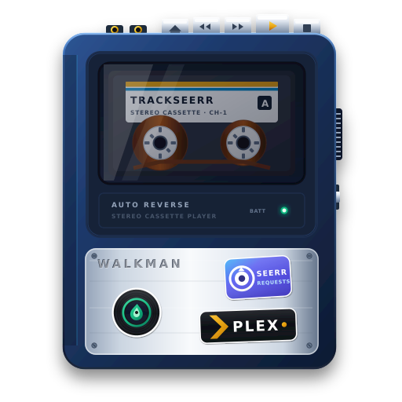

<p align="center">
  
</p>

# TrackSeerr

[](https://github.com/RonFBurgundy/trackseerr/actions/workflows/ci.yml)
[](https://github.com/RonFBurgundy/trackseerr/actions/workflows/docker-publish.yml)
[](LICENSE.md)
[](https://www.python.org/downloads/release/python-3120/)
[](#overview)

---

> [!WARNING]
> **Work in Progress: Active Development**
> TrackSeerr is currently under active development. Core features, API schemas, and deployment topologies are undergoing rapid implementation and refinement. Please stand by for upcoming tagged releases and milestone announcements before relying on this software in production homelab environments.

---

## Overview

**TrackSeerr** is a self-hosted music discovery, request, and library management suite for **Plex Media Server**, **Plexamp**, and homelab music pipelines. It combines an **Overseerr-style frontend** for family discovery and request management with an **Arr-style media management and acquisition backend**.

TrackSeerr allows Plex Home users to discover new music, listen to previews, submit requests within configured quotas, and import playlists from Spotify and Deezer directly into their personal Plexamp libraries. Administrators can fulfill requests using an existing Lidarr instance or using native acquisition drivers (slskd, SABnzbd, qBittorrent, and Torznab/Newznab indexers) with built-in Mutagen audio tagging and token template file organization.

> [!IMPORTANT]
> TrackSeerr matches existing media in your local Plex music library and manages acquisitions through configured download clients or Lidarr. It does not rip or scrape audio streams from third-party services.

---

## System Architecture

```
+-----------------------------------------------------------------------+
|                            Frontend Layer                             |
|  - Plex OAuth Authentication & Plex Home Multi-User Routing           |
|  - Zero-Key Music Discovery (Apple Music / iTunes & Deezer APIs)       |
|  - 30-Second Audio Previews & Trending Charts                         |
|  - Multi-User Request Engine (Quotas, Approval Queue, Lifecycle)      |
|  - Spotify & Deezer Playlist Sync (Keyless Scraper & Bookmarklet)     |
+-----------------------------------------------------------------------+
                                    |
                                    v
+-----------------------------------------------------------------------+
|                            Backend Layer                              |
|                                                                       |
|  Option A: Lidarr Mode              Option B: Native Library Mode     |
|  - Paced Trickle Worker             - 3-Tier Catalog & Monitoring     |
|  - Targeted Album Searches          - slskd, SABnzbd, qBittorrent     |
|  - Automated Webhook Loop           - Scanner, Importer & Renamer     |
+-----------------------------------------------------------------------+
                                    |
                                    v
+-----------------------------------------------------------------------+
|                    Media Management Pipeline                          |
|  - Mutagen Audio Inspection (FLAC, MP3 ID3, M4A/AAC, Ogg/Opus)        |
|  - Arr-Grade Token Naming ({Artist Name}/{Album Title}/{track:00})    |
|  - Cross-Device Safe Atomic Moves & Collision Protection              |
|  - Automated Plex Media Server Library Refresh Notifications          |
+-----------------------------------------------------------------------+
```

### Frontend: Discovery, Requests & Family Governance
- **Zero-Key Discovery**: Search albums and tracks, browse trending releases, and inspect Deezer and Apple Music charts without API keys or developer accounts.
- **Deep Album & Artist Browsing**: Click any album to view full tracklists with 30-second audio previews, or browse an artist's entire discography organized by Studio Albums, EPs/Singles, and Compilations.
- **Flexible Requests**: Request complete albums or cherry-pick specific individual tracks in a single batch submission.
- **Family Governance & Quotas**: Overseerr-style rolling request quotas (e.g. 5 requests per 7 days) and granular permission controls for family members.
- **Issue Reporting**: Family members can report audio glitches, corrupted files, or wrong versions directly into an admin triage queue.
- **Outbound Notifications**: Instant notifications via Discord (with rich embeds and cover art), Telegram, Pushover, generic Webhooks, and Email when music is requested, grabbed, or ready in Plex.
- **Personal & Household Playlists**: Sync public playlists, user playlists, or import Liked Songs using the 1-click browser bookmarklet. Target playlists to individual users, groups, or the whole household.

### Backend: Autonomous Acquisition & Media Management
TrackSeerr gives administrators the choice between two acquisition and library management workflows via the **Operational Mode Switch** (`LIBRARY_MODE=native|lidarr`):

- **`native` (Default)**: Standalone Arr-grade library coordinator managing full cataloging, monitoring, disk scanning, manual importing, batch renaming, and autonomous acquisition.
- **`lidarr`**: Overseerr-style gateway mode delegating file handling and download orchestration to Lidarr with zero split-brain collisions.

#### 1. Native Library Management & Catalog Engine
When running in `native` mode, TrackSeerr acts as a complete music library system:
- **Three-Tier Catalog Schema**: Backed by persistent SQLite tables (`library_artists`, `library_albums`, `library_tracks`, `library_files`) with granular monitoring toggles at artist, album, or individual track levels, supporting cascading monitoring inheritance.
- **Recursive Filesystem Scanner**: Non-destructive scanner for `/music` that extracts Mutagen audio stream metrics (codecs, bit depth, sample rates, bitrates) and tags, reconciles files against catalog entries, evaluates Quality Profile cutoffs, prunes missing files on demand, and triggers Plex library refreshes.
- **Interactive Manual Import Queue**: Staging directory scanner with fuzzy candidate matching, confidence ratings (0–100%), standardized audio tag writing, and configurable import modes (`move`, `hardlink`, `copy`).
- **Token Template Batch Renamer**: Scans existing library paths against your active Arr naming template, previews side-by-side path diffs, and executes atomic cross-mount renames.
- **1-Click Lidarr API Migration**: Background migration job pulling an existing Lidarr instance's artists, albums, tracks, track files, and MusicBrainz IDs (`MBIDs`) via REST API, automatically transitioning the instance into `native` mode upon completion.

#### 2. Native Autonomous Acquisition
Operate TrackSeerr as an independent downloader coordinator without running Lidarr:
- **Download Drivers**: Native connections to slskd (Soulseek P2P for surgical single/EP matching), SABnzbd (Usenet via Newznab), and qBittorrent (BitTorrent via Torznab).
- **15-Minute RSS Sync**: Automatically polls indexer RSS feeds to snatch new releases the moment they are uploaded.
- **Wanted Backlog Sweeps**: Unfulfilled requests and missing tracks are re-checked automatically until a matching release appears.
- **Archive Extraction**: Automatically unpacks `.zip`, `.tar.gz`, and multi-part archives in download staging.
- **Quality Upgrades**: If music was grabbed in lower quality (e.g. MP3 320), TrackSeerr keeps looking for FLAC releases and upgrades your library files automatically when found.
- **Queue Cleanup**: Automatically removes finished downloads from client queues after import without touching your media files.
- **Media Management**: Inspect tags with Mutagen, format destination folders using customizable token templates (e.g. `{Artist Name}/{Album Title} ({Release Year})/{track:00} - {Track Title}`), handle collisions safely, and notify Plex when imports finish.

#### 3. Lidarr Integration Mode
Connect to an existing Lidarr server. TrackSeerr groups missing tracks by artist and feeds Lidarr through a rate-limited background trickle worker, avoiding full discography downloads and protecting MusicBrainz from API rate limits. All file movement and organization is delegated to Lidarr.

---

## Deployment Topologies

TrackSeerr supports two deployment models depending on your infrastructure:

### 1. Single-Container Mode (`ROLE=all-in-one`)
The default homelab configuration. The web UI, API, sync scheduler, and download organizer run within a single container. Suitable for private LANs, VPN access, and standard Unraid setups.

### 2. Hardened Two-Tier DMZ Mode (`docker-compose.hardened.yml`)
For exposed environments, TrackSeerr can be deployed across two isolated network tiers:

- **Tier 1 (Public Gateway - `trackseerr-gateway`)**: Placed on the reverse proxy network (`proxynet`). Completely stateless with zero volume mounts, zero media storage access, and zero downloader credentials. Handles public ingress, Plex OAuth, discovery queries, and request submissions.
- **Tier 2 (Internal Core - `trackseerr-core`)**: Isolated on `internal-net` with no public port exposure. Mounts `/data`, `/music`, and `/downloads`. Manages downloader credentials, indexers, file organization, Mutagen inspection, and Plex library refresh pings.

*For complete details on threat boundaries and configuration, see the [Architecture and Security Reference](docs/ARCHITECTURE_AND_SECURITY.md).*

---

## Quick Start

### Unraid Deployment

Open your Unraid Terminal and download the template:

```bash
curl -o /boot/config/plugins/dockerMan/templates-user/my-trackseerr.xml \
  https://raw.githubusercontent.com/RonFBurgundy/trackseerr/main/unraid/trackseerr.xml
```

Navigate to **Docker** -> **Add Container** -> select **my-trackseerr** from the **Template** dropdown, verify your Plex server IP address, and click **Apply**.

*Read the [Unraid Installation Guide](docs/UNRAID_INSTALL_GUIDE.md) for full walkthroughs and storage mount instructions.*

---

### Docker Compose: Single-Container Mode

```yaml
services:
  trackseerr:
    image: ghcr.io/ronfburgundy/trackseerr:latest
    container_name: trackseerr
    restart: unless-stopped
    ports:
      - "5250:5250"
    volumes:
      - ./appdata:/config
      # TRaSH Guides unified data share (holds /data/media/music and /data/downloads)
      - /path/to/data:/data
    environment:
      - ROLE=all-in-one
      - PORT=5250
      - PUID=1000
      - PGID=1000
      - UMASK=022
      - PLEX_URL=http://192.168.1.100:32400
      - PLEX_TOKEN=your_plex_token_here
      - PLEX_MUSIC_SECTION=Music
      - PLEX_VERIFY_SSL=1
      - SECONDS_TO_WAIT=14400 # 4 hours
      - LOG_LEVEL=INFO
      # Spotify: Leave blank to use the built-in keyless web scraper
      - SPOTIFY_CLIENT_ID=
      - SPOTIFY_CLIENT_SECRET=
      # Note: Lidarr, download clients, indexers, and quotas are configured in the WebUI Settings
```

Run with:
```bash
docker compose up -d
```

Access the dashboard at `http://<your-server-ip>:5250`.

---

### Docker Compose: Hardened Two-Tier DMZ Mode

```yaml
version: '3.8'

services:
  trackseerr-gateway:
    image: ghcr.io/ronfburgundy/trackseerr:latest
    container_name: trackseerr-gateway
    restart: unless-stopped
    ports:
      - "5250:5250"
    environment:
      - ROLE=gateway
      - TRACKSEERR_CORE_URL=http://trackseerr-core:5251
      - PORT=5250
      - PUID=1000
      - PGID=1000
      - UMASK=022
      - LOG_LEVEL=INFO
    networks:
      - proxynet
      - internal-net

  trackseerr-core:
    image: ghcr.io/ronfburgundy/trackseerr:latest
    container_name: trackseerr-core
    restart: unless-stopped
    expose:
      - "5251"
    volumes:
      - ./appdata:/config
      - /path/to/data:/data
    environment:
      - ROLE=core
      - PORT=5251
      - PUID=1000
      - PGID=1000
      - UMASK=022
      - PLEX_URL=http://192.168.1.100:32400
      - PLEX_TOKEN=your_plex_token_here
      - PLEX_MUSIC_SECTION=Music
      - PLEX_VERIFY_SSL=1
      - SECONDS_TO_WAIT=14400
      - SEARCH_SIMILARITY_THRESHOLD=0.9
      - LOG_LEVEL=INFO
    networks:
      - internal-net

networks:
  proxynet:
    name: proxynet
    driver: bridge
  internal-net:
    name: trackseerr-internal-net
    internal: true
```

---

## Configuration Reference

| Variable | Default | Description |
|---|---|---|
| `ROLE` | `all-in-one` | Container execution mode: `all-in-one`, `gateway`, or `core` |
| `TRACKSEERR_CORE_URL` | *None* | Core endpoint URL required when running in `gateway` mode |
| `LIBRARY_MODE` | `native` | Operational mode: `native` for full TrackSeerr catalog & library management, or `lidarr` for external Lidarr delegation |
| `PORT` | `5250` | Port for the web service |
| `HOST` | `0.0.0.0` | Host binding interface |
| `PUID` / `PGID` | `1000` / `1000` | User and group ID for filesystem operations (`99`/`100` on Unraid) |
| `UMASK` | `022` | File creation permissions mask |
| `PLEX_URL` | *Required* | Base URL to your Plex Media Server (e.g. `http://192.168.1.100:32400`) |
| `PLEX_TOKEN` | *Required* | Plex administrator `X-Plex-Token` |
| `PLEX_MUSIC_SECTION` | `Music` | Plex music library section name |
| `PLEX_MACHINE_IDENTIFIER` | *Auto* | Plex machine ID for pinning multi-user access |
| `PLEX_VERIFY_SSL` | `1` | Set to `0` or `false` to disable SSL certificate verification |
| `SECONDS_TO_WAIT` | `86400` | Seconds between automated background playlist sync cycles |
| `RUN_ONCE` / `CRON` | `0` | Set to `1` to run a single sync pass and exit |
| `SEARCH_SIMILARITY_THRESHOLD` | `0.9` | Fuzzy match ratio (0.0 to 1.0) for track matching |
| `APPEND_SERVICE_SUFFIX` | `1` | Append ` - Spotify` or ` - Deezer` to synced playlist names |
| `ADD_PLAYLIST_POSTER` | `1` | Sync playlist artwork to Plex playlists |
| `ADD_PLAYLIST_DESCRIPTION` | `1` | Sync playlist descriptions to Plex playlists |
| `APPEND_INSTEAD_OF_SYNC` | `0` | Set to `1` to append tracks without removing deleted ones |
| `WRITE_MISSING_AS_CSV` | `0` | Export missing track CSV reports to `/data` |
| `AUTO_APPROVE_REQUESTS` | `0` | Set to `1` to automatically approve user music requests |
| `USER_REQUEST_QUOTA` | `25` | Maximum number of active/pending requests allowed per user |
| `SPOTIFY_CLIENT_ID` | *Optional* | Spotify Developer Client ID (leave blank for keyless scraper) |
| `SPOTIFY_CLIENT_SECRET` | *Optional* | Spotify Developer Client Secret |
| `SPOTIFY_USER_ID` | *Optional* | Spotify user profile ID to mirror all playlists |
| `SPOTIFY_PLAYLIST_ID` | *Optional* | List of Spotify playlist IDs, URLs, or URIs to sync |
| `DEEZER_USER_ID` | *Optional* | Deezer numerical user ID to mirror playlists |
| `DEEZER_PLAYLIST_ID` | *Optional* | List of Deezer numerical playlist IDs or URLs |
| `LIDARR_URL` | *Optional* | Base URL to Lidarr server (e.g. `http://192.168.1.100:8686`) |
| `LIDARR_API_KEY` | *Optional* | Lidarr API Key |
| `LIDARR_AUTO_SEARCH` | `1` | Trigger interactive search when queuing missing tracks |
| `LIDARR_TRICKLE_RATE_SECONDS` | `3.0` | Seconds between artist lookups during trickle push |
| `LIDARR_TRICKLE_BATCH_SIZE` | `25` | Number of tracks per manual chunk or scheduled drip |
| `LIDARR_AUTO_TRICKLE` | `0` | Set to `1` to enable scheduled background trickle runs |
| `LIDARR_AUTO_TRICKLE_INTERVAL_MINUTES` | `30` | Interval in minutes between scheduled trickle runs |
| `LIDARR_ROOT_FOLDER` | *Auto* | Custom Lidarr root folder path override |
| `LIDARR_QUALITY_PROFILE_ID` | *Auto* | Custom Lidarr quality profile ID override |
| `LIDARR_METADATA_PROFILE_ID` | *Auto* | Custom Lidarr metadata profile ID override |
| `ENABLE_BACKLOG_SEARCH` | `1` | Periodically sweep unfulfilled requests and missing tracks |
| `BACKLOG_SEARCH_INTERVAL_MINUTES` | `60` | Interval in minutes between automated backlog search sweeps |
| `ENABLE_RSS_SYNC` | `1` | Periodically poll Torznab/Newznab indexers for new releases |
| `RSS_SYNC_INTERVAL_MINUTES` | `15` | Interval in minutes between indexer RSS sync loops |
| `FEED_TOKEN` | *Optional* | Secret token protecting RSS feeds, plain text lists, and webhooks |
| `LOG_LEVEL` | `INFO` | Logging verbosity (`DEBUG`, `INFO`, `WARNING`, `ERROR`) |

---

## Documentation Guides

- [Architecture and Security Reference](docs/ARCHITECTURE_AND_SECURITY.md): Deep dive into the two-tier DMZ isolation, SSRF defenses, token engine, and Mutagen pipeline.
- [Unraid Installation Guide](docs/UNRAID_INSTALL_GUIDE.md): Step-by-step setup using Unraid templates and community plugins.
- [Acquisition and Automation Guide](docs/LIDARR_AND_AUTOMATION_GUIDE.md): Detailed configuration for native drivers (slskd, SABnzbd, qBittorrent) and Lidarr trickle mode.
- [Spotify Import & Keyless Sync Guide](docs/SPOTIFY_IMPORT_GUIDE.md): Importing personal Spotify playlists, Liked Songs, and using the 1-click browser bookmarklet.

---

## Security Policy

Security and least privilege are central to TrackSeerr's design. All user-supplied URLs are strictly validated against whitelists before dispatch, input file operations are sandboxed against path traversal, and no shell commands or subprocesses are executed from API endpoints.

See [SECURITY.md](SECURITY.md) and the [Architecture and Security Reference](docs/ARCHITECTURE_AND_SECURITY.md) for full details.

---

## Lineage and Open Source Acknowledgments

TrackSeerr was originally conceived from [rnagabhyrava/plex-playlist-sync](https://github.com/rnagabhyrava/plex-playlist-sync). We extend our sincere gratitude to the original author for the foundational playlist matching concept.

TrackSeerr has been re-architected and expanded into an independent music discovery and acquisition manager. We gratefully acknowledge the design inspiration and open-source foundations provided by:

- **Overseerr**: Architectural inspiration for discovery, quotas, and multi-user request management.
- **Lidarr and Sonarr (*arr Stack)**: Standards for token template naming, quality tracking, and downloader lifecycle management.
- **Mutagen**: Cross-platform audio stream tag inspection and metadata extraction.
- **slskd**: REST API implementation of the Soulseek network, enabling single-track and album surgical discovery.

---

## License

GNU General Public License v3 (GPL-3.0). See [LICENSE.md](LICENSE.md) for details.
